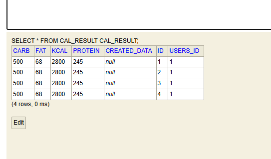
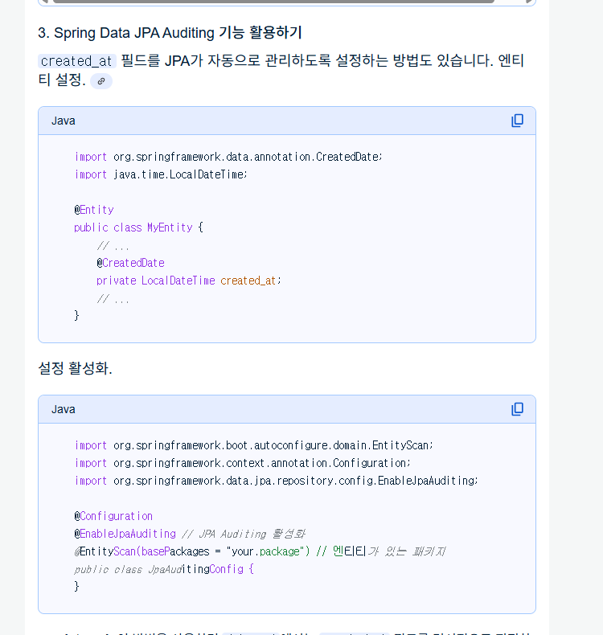

# 건강관리 웹앱 - Hompass

# 환경 설정
1. Tailwind css 라이브러리
- 참조 문서 :
- https://gerrymandering.tistory.com/entry/%EC%8A%A4%ED%94%84%EB%A7%81%EB%B6%80%ED%8A%B8%EC%97%90%EC%84%9C-Tailwind-CSS-%EC%82%AC%EC%9A%A9%ED%95%98%EA%B8%B0
- https://kamsi76.tistory.com/entry/tailwindcss-Spring-Boot-Thymeleaf-%EC%97%90-TailwindCSS-%EC%84%A4%EC%A0%95%EB%B0%A9%EB%B2%95
# 요구사항 척도

- [o] 사용자는 hompass의 메인 화면을 확인 할 수 있다. (로고와 타이틀이 작성된 헤더)
- [o] 사용자는 hompass에 대한 간단한 설명 텍스트가 적혀있는 설명 섹션을 확인 할 수 있어야 한다.
- [o] 사용자는 hompass의 홈화면에서 시작하기 버튼을 눌러서. 자가진단 화면페이지로 넘어갈수 있어야 한다.
- [o] 사용자는 hompass의 두번째 하루 필요 칼로리 계산 페이지에서 사용자의 성별을 입력 받을 수 있다.
- [o] 사용자는 hompass의 두번째 하루 필요 칼로리 계산 페이지에서 사용자의 나이를 입력 받을 수 있다.
- [o] 사용자는 hompass의 두번째 하루 필요 칼로리 계산 페이지에서 사용자의 키를 입력 받을 수 있다.
- [o] 사용자는 hompass의 두번째 하루 필요 칼로리 계산 페이지에서 사용자의 활동량을 라디오 버튼으로 입력 받을 수 있다.

# 문제 해결 사항
1. Tailwind css 라이브러리 설치시 과거의 포스팅글 (2023)년 기준
>npm install -D tailwindcss postcss autoprefixer

문제점 : 현재 이렇게 명령어를 작성해서 관련 라이브러리 설치 할경우 최신기준 ver4가 설치되어서
블로그포스팅 안내글에 따른 tailwindcss 라이브러리 설정을 할 수 가 없었다.

해결방법 : - https://kamsi76.tistory.com/entry/tailwindcss-Spring-Boot-Thymeleaf-%EC%97%90-TailwindCSS-%EC%84%A4%EC%A0%95%EB%B0%A9%EB%B2%95

해당 블로그의 글을 참조해서.
명시적으로 ver3의 tailwindcss 라이브러리를 설치 할 수 있도록 해주었다.

>npm install --save-dev tailwindcss@3 postcss autoprefixer

2. h2 데이터베이스 생성중 발생 에러

> Caused by: org.h2.jdbc.JdbcSQLSyntaxErrorException: Syntax error in SQL statement "drop table if exists [*]user cascade "; expected "identifier"; SQL statement:

문제점: User 엔터티 클래스를 작성후 실행하였더니 위의 에러가 발생하였다.

해결 방법 : - https://kchs94.tistory.com/220

유사한 문제에 대한 검색을 서칭하여 위의 블로그 글을 찾아냈고 해당 글을 참조하여
h2데이터베이스에서 User가 예약어이기때문에 테이블명으로 사용할수 없다는것을 알게되어
user뒤에 s를 붙여 users로 작성해주니 문제없이 작동되었다.

3. No default constructor for entity

문제점: 연령 선택 -> 자가진단 페이지에서 question 테이블에 임시로 넣어둔 데이터들을 모두 조회해와서.
해당 리스트들을 모델에 추가하여 동적렌더링을 시도하는 과정에서.
>ArrayList<Question> questionEntityList = questionRepository.findAll();

이부분에서 에러가 발생하고있었는데. No default constructor for entity에러가 발생하였음.

해결방법 : - https://velog.io/@jaeyumn/JPA-No-default-constructor-for-entity

Question Entity의 Lombok을 통해 @NoArgsConstructor 애터네이션을 작성해서 기본생성자를 만들어주었더니 해결되었다. 

4. api 전송 요청후 body값 반환이 {}가 오는 현상?

문제점 : 유저의 신체정보  데이터를 저장하기 위해서 post api 요청을 하나만들어두었는데.
데이터를 전송해서 저장해서 h2 db에 저장된것은 확인했는데. 
요청후 전송받은 body는 {}가 오는 현상을 발견함

해결 방법 : gpt한테 해당 문제에 대해서 다음과 같이 질문함 
>스프링부트로 api 컨트롤러를 통해 post 요청을 하나만들었는데. 만약에 json 데이터 사이트를 통해 post요청에 올바르게 body에 필요한데이터를 함꼐 동봉해서 전송해서 h2 db에 저장된것은 확인햇는데 테스트사이트에서 데이터를 전송요청하고 body로 응답을 주는데 {}를 주는데 저장은됫는데 반환값은 {}인 경우 어떤 문제를 의심해볼수있는가?

gpt의 말로는 DTO/엔터티 파일에 Getter가 없어서 그렇다고함.

Getter를 양쪽 클래스파일에 추가해주었더니 원활하게 문제가 해결되었음.

5. api 조회 요청후 빈 값이 오는 현상

문제점: /api/tdee 조회 요청후 api값을 조회해와야하는데.
조회를 못해오고있는 문제점.

해결 방법 : Users entity에 @NoArgsConstructor를 붙이니깐 해결되었다.

- https://curiousjinan.tistory.com/entry/spring-jpa-why-default-constructor-is-required

- https://wakestand.tistory.com/926
엔터티 기본 생성자가 없어서 발생한 문제였다.

6. create_at 속성 자동 생성이 안됨.

문제점 : CalResult 더미데이터 삽입 테스트를 진행하기 위해 결과 저장 날짜 정보인 create_at이 자동으로 현재시간으로 매칭이 되게끔 설정함.

참조한 문서
- https://hulrud.tistory.com/76 

 

더미데이터 삽입후 null로 찍히는것을 확인함. 

구글링을 해보니. 이 기능은 Spring Data JPA Auditing 기능으로 무언가를 설정해줘야하는것으로 확인됨. 

시도 1 
-https://joyerim.tistory.com/17 
다음의 문서를 따라해서 baseentity를 따로 만들어두고 상속해서 사용하게하였음
-> but 해결되지 않음 , 대신에 엔터티를 상속해서 사용하는 개념에 대한 지식을 얻음

시도 2
- gpt 에게 다음과 같은 프롬프팅 질문
> 다음과같이 JPA Auditing기능을활성화시켜 생성,수정날짜에 대한 속성을 자동으로 등록되게 해두엇는데 data.sql을통해 더미데이터를 삽입하였고 h2콘솔에서 조회해보니 해당 속성들이 null로 찍히는데 이유가뭘까

- gpt의 답 :
> 좋은 질문입니다. 요약하면 JPA Auditing은 “엔티티가 JPA를 통해 저장/수정될 때”만 동작하고, data.sql로 SQL을 직접 실행해 넣은 더미 데이터는 엔티티 리스너가 전혀 개입하지 않기 때문에 @CreatedDate, @LastModifiedDate가 NULL로 남습니다. data.sql은 지금처럼 단순 INSERT만 하죠.

JPA를 통해 데이터를 삽입한게 아니라 DATA.SQL로 직접 쿼리문을 작성해 기입한거라 안된것.

해결 방법 : 쿼리문 자체에서 CURRENT_TIMESTMAP 함수로 직접 현재 시간 넣어줌.

> INSERT INTO CAL_RESULT(users_id, kcal, carb, protein, fat, created_at, updated_at)
VALUES (1, 2800, 500, 245, 68, CURRENT_TIMESTAMP, CURRENT_TIMESTAMP);